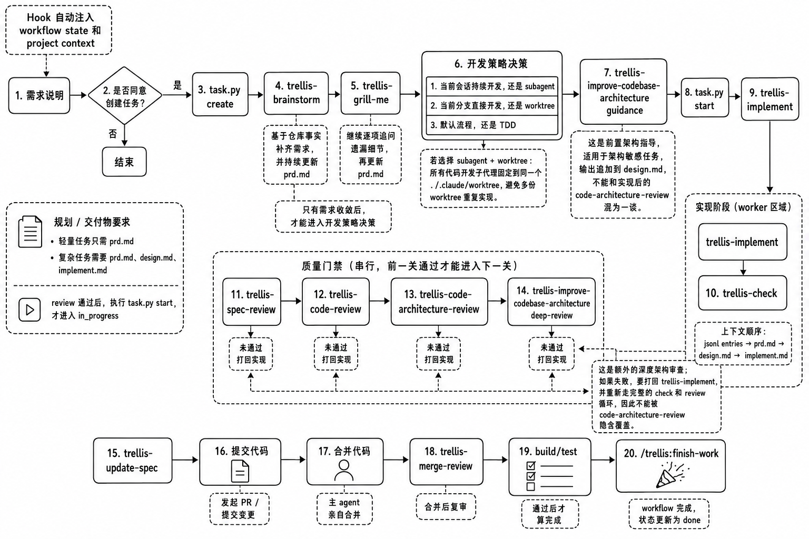

<p align="center">
<picture>
<source srcset="assets/trellis.png" media="(prefers-color-scheme: dark)">
<source srcset="assets/trellis.png" media="(prefers-color-scheme: light)">

</picture>
</p>

<p align="center">
<strong>面向 Claude Code 的 Trellis 魔改工作流</strong><br/>
<sub>把需求对齐、任务规划、开发策略、实现门禁、架构收敛和会话记忆落到仓库文件里，而不是塞进一段越来越长的系统提示词。</sub>
</p>

<p align="center">
<a href="./README_CN.md">原中文版</a> •
<a href="https://docs.trytrellis.app/zh">官方文档</a> •
<a href="#快速开始">快速开始</a> •
<a href="#工作流总览">工作流总览</a> •
<a href="#目录结构">目录结构</a> •
<a href="https://linux.do">LinuxDo</a>
</p>

<p align="center">
<a href="https://www.npmjs.com/package/trellis-hgl"></a>
<a href="https://www.npmjs.com/package/trellis-hgl"></a>
<a href="https://github.com/LonelyHerbivore/Trellis-Herbivore/blob/main/LICENSE"></a>
<a href="https://linux.do"></a>
</p>

<p align="center">

</p>

## 这是什么

这个分支不是在重新发明一个新的 AI coding 工具，而是在 `Trellis-0.6.0-beta.17` 的基础上，针对 **Claude Code 单工具工作流** 做定向增强：

- 保留 Trellis 原有的 `init`、任务系统、Spec 系统、workspace 记忆、平台接入与 npm 发布能力
- 把需求对齐、开发策略决策、多重 review gate、架构约束和最终收尾流程进一步前置、显式化
- 强调“**先规划，再实现；先对齐，再放行**”
- 尽量让真正重要的过程信息沉淀到仓库文件，而不是散落在聊天上下文里

一句话说，这个分支想把 Trellis 调整成更适合 **自然语言驱动 + Claude Code 主导 + 中文文档可审阅** 的工程化工作流。

## 为什么要做这个魔改

这个分支的目标很明确：

1. **只做加法，不做减法**
   - 保留 Trellis 现有能力
   - 在其上融入更强的需求对齐、策略决策和质量门禁

2. **把“如何和 AI 协作开发”变成明确流程**
   - 不是用户一句“去做吧”，AI 就直接写代码
   - 而是先进入任务、PRD、brainstorm、grill、策略决策，再进入实现

3. **让开发策略本身成为任务文档的一部分**
   - 当前会话直做，还是 subagent
   - 当前分支直改，还是 worktree
   - 默认流程，还是 TDD
   - 这次任务要不要启用 `trellis-spec-review`、`trellis-code-review`、`trellis-code-architecture-review`、`trellis-improve-codebase-architecture`、`trellis-merge-review`

4. **把 AI 容易忽略的工程门禁变成显式节点**
   - 固定保留：`trellis-check`
   - 任务级可选：`trellis-spec-review`
   - 任务级可选：`trellis-code-review`
   - 任务级可选：`trellis-code-architecture-review`
   - 任务级可选：`trellis-improve-codebase-architecture`
   - 任务级可选：`trellis-merge-review`
   - 最终 build/test 继续保留
  
5. **随时可跳出Trellis流程**
   - 随时都可以直接对Claude说: "当前任务直接存档"，即可跳出工作流直接结束任务

## 核心理念

### 1. Spec 是注入的，不是靠记忆的

项目规范写进 `.trellis/spec/` 之后，AI 不需要在每次会话里重新听一遍“这个仓库怎么做事”，而是按任务、按阶段加载真正相关的部分。

### 2. 任务是工作流载体，不只是待办项

在这个分支里，任务目录不只是记录状态，还承载：

- `prd.md`：需求与验收标准
- `design.md`：复杂任务的技术设计
- `implement.md`：实现策略、review gate、验证与回滚点
- `implement.jsonl` / `check.jsonl`：给 implement / check agent 装配上下文

### 3. 需求对齐与开发策略必须显式落盘

这里最强调的一点是：

- `trellis-brainstorm` 不等于需求已经收敛
- `trellis-grill-me` 不等于开发策略已经确定
- `task.py start` 之前，必须把关键决策写进任务文档

### 4. Review gate 不是一次性“跑个检查”

这个分支把质量控制拆成几层：

- 固定检查：`trellis-check`
- 任务级可选 gate：
  - `trellis-spec-review`
  - `trellis-code-review`
  - `trellis-code-architecture-review`
  - `trellis-improve-codebase-architecture`
  - `trellis-merge-review`
- 其中 `trellis-spec-review` → `trellis-code-review` → `trellis-code-architecture-review` 一旦启用，仍保持这个顺序
- 对新任务，这 5 个可选 gate 默认全关；对老任务，若任务文档没有选择记录，则沿用旧行为
- 最终 `build/test` 继续保留

## 工作流总览

更贴近这个本地分支真实意图的一条主线是：

```text
用户自然语言提出需求
→ 判断是否需要创建 Trellis 任务
→ task.py create
→ trellis-brainstorm
→ trellis-grill-me
→ 开发策略决策（同一选项块里确定 subagent/worktree/TDD/review gates）
→ （按需）trellis-improve-codebase-architecture guidance
→ task.py start
→ trellis-implement
→ trellis-check
→ （按任务选择）trellis-spec-review
→ （按任务选择）trellis-code-review
→ （按任务选择）trellis-code-architecture-review
→ （按任务选择）trellis-improve-codebase-architecture deep-review
→ trellis-update-spec
→ 提交代码
→ 主 agent 合并
→ （按任务选择）trellis-merge-review
→ build/test
→ /trellis:finish-work
```

### 开发策略决策包含什么

进入实现前，至少要明确五项：

1. 当前会话持续开发，还是 subagent
2. 当前分支直接开发，还是 worktree
3. 走 Trellis 默认开发流程，还是 TDD
4. 这次任务要启用哪些 review gate（5 个可选 gate 必须落盘为 `Review-gate contract: explicit-selection-v1` + `Optional review gates status: configured` + enabled/disabled 列表；就算 5 个都不启用，也要显式写进 disabled，`trellis-check` 固定保留）
5. 是否在进入实现前运行 `trellis-improve-codebase-architecture guidance`（这不会隐式开启 deep-review；后者仍需在 review gate 里显式选择，而且 deep-review 依赖 `trellis-code-architecture-review`）

如果选择 `subagent + worktree`，本分支约定所有代码开发子代理固定使用同一个路径：

```text
./.trellis/trellis-worktrees/<task-dir-name>
```

这和 Claude Code 宿主级的 `Agent(..., isolation: "worktree")` 不是一回事。共享路径策略下，不要再额外启用宿主 isolation worktree；如果真实派发仍带上这个输入，Trellis 的 Claude hook 会自动移除它并给出提示。

这样可以避免多个 worktree 上重复实现同一个任务，浪费上下文和 token。

### 为什么要有 `trellis-improve-codebase-architecture`

这个 skill 不是普通 code review 的别名，它在这个分支里承担两种不同职责：

1. **guidance（开发前指导）**
   - 放在 `task.py start` 之前
   - 针对架构敏感任务，先给边界、抽象与风险建议
   - 结果追加到 `design.md`

2. **deep-review（深度审查）**
   - 放在 `trellis-code-architecture-review` 之后
   - 作为额外的结构性深审
   - 如果失败，要打回实现并重走 review 流程

因此，它不能被 `trellis-code-architecture-review` 隐含覆盖。

## 目录结构

```text
.trellis/
├── spec/                    # 项目规范、模式和指南（按 package/layer 组织）
├── tasks/                   # 任务 PRD、设计、实现计划、状态与上下文
├── workspace/               # Journal 和开发者级连续性
├── workflow.md              # 三阶段工作流与 breadcrumb 真相源
└── scripts/                 # 驱动任务、上下文与收尾流程的脚本
```

除此之外，Trellis 还会根据平台生成接入文件，例如：

- `.claude/`
- `.cursor/`
- `.codex/`
- `.agents/`
- `AGENTS.md`

但对这个分支来说，**主要关注点默认是 Claude Code**。

## Claude Code 下的自动注入

以当前根目录 `Trellis-0.6.0-beta.17` 为例，自动注入主要看这 3 个文件：

1. `.claude/hooks/session-start.py`
   - 触发时机：`startup`、`clear`、`compact`
   - 注入内容：`<session-context>`、`<first-reply-notice>`、`<current-state>`、`<trellis-workflow>`、`<guidelines>`、`<task-status>`、`<ready>`
   - 作用：开场先把仓库状态、任务状态和 workflow 摘要喂给主会话

2. `.claude/hooks/inject-workflow-state.py`
   - 触发时机：每次用户提交消息前（`UserPromptSubmit`）
   - 注入内容：简短的 `<workflow-state>`
   - 作用：提示当前 task 状态和下一步该走的 workflow

3. `.claude/hooks/inject-subagent-context.py`
   - 触发时机：调用 `Task` / `Agent` 子代理前（`PreToolUse`）
   - 注入内容：`implement.jsonl`、`check.jsonl`、`prd.md`、`design.md`、`implement.md`
   - 作用：把任务文档自动拼进 implement / check / research 子代理的 prompt

一句话：**开头看全局，发言前看状态，调子代理前看任务文件。**

## 快速开始

### 前置要求

- **Node.js** >= 18
- **Python** >= 3.9

### 安装

```bash
npm install -g trellis-hgl@beta
```

### 卸载

```bash
npm uninstall -g trellis-hgl
```

### 替换原版trellis

```bash
# 卸载旧版 trellis
npm uninstall -g @mindfoldhq/trellis

# 安装最新版 trellis-hgl
npm install -g trellis-hgl@beta

# 进入你自己的项目目录
cd /path/to/your/project

# 已经初始化过的项目，执行更新（按需选择文件是否OverWrite）
trellis update

# 第一次使用的项目，执行初始化
trellis init -u yourname --claude
```

### 初始化仓库

```bash
# 创建开发者 workspace
trellis init -u your-name --claude
```

如果你需要按平台生成接入文件，也可以组合初始化参数；但这个分支的默认关注点是 Claude Code 路径。

### 第一次使用

更符合这个分支预期的使用方式是：

1. 在项目里完成 `trellis init`
2. 用自然语言告诉 Claude Code 你的需求
3. 让 Claude 根据 workflow 先进入任务与 planning
4. 在 planning 完整之后再进入实现

也就是说，推荐心智模型不是“先找命令再操作”，而是：

> **先用自然语言发起需求，后台再由 Trellis 把需求变成任务、产物和流程。**

## 适合什么场景

### 1. 希望 AI 不要一上来就写代码

如果你更在意先对齐需求、先收敛边界、先确定实现策略，这个分支会更适合你。

### 2. 希望把开发策略也纳入规范

很多团队会规定代码风格，但不会规定“什么时候用 subagent、什么时候上 worktree、什么时候切到 TDD”。这个分支专门把这些决策前置到 planning 阶段。

### 3. 希望让质量门禁更难被跳过

它不是只跑一次检查，而是把实现后检查、正式 review gate、架构深审、merge review 和最终 build/test 分层表达出来。

### 4. 希望文档和任务产物可以用中文审阅

这个分支强调规划文档、任务文档、流程文档和说明性产物默认用中文写，方便直接 review。

## 与原版 Trellis 的关系

这个分支依然保留 Trellis 作为“团队 AI coding harness”的核心结构：

- `.trellis/spec/`
- `.trellis/tasks/`
- `.trellis/workspace/`
- `.trellis/workflow.md`
- 各平台适配层

区别在于，它把下面这些能力进一步拉高为一等公民：

- `trellis-grill-me`
- 开发策略决策
- `trellis-improve-codebase-architecture`
- 多重 review gate
- merge 后再验证
- 中文产物优先

## 进一步了解

如果你想继续理解这个分支，建议按这个顺序看：

1. `.trellis/workflow.md`
2. `CLAUDE.md`
3. `packages/cli/src/templates/trellis/workflow.md`
4. `packages/cli/src/configurators/`
5. `packages/cli/src/commands/`

其中：

- `.trellis/workflow.md` 更接近当前本地运行状态
- `packages/cli/src/templates/trellis/workflow.md` 更接近模板真相源和后续生成逻辑
- `packages/cli/src/configurators/` 与 `packages/cli/src/commands/` 适合继续追踪初始化、模板生成和命令入口

## 社区与资源

- [官方文档](https://docs.trytrellis.app/zh)
- [快速开始](https://docs.trytrellis.app/zh/guide/ch02-quick-start)
- [支持平台](https://docs.trytrellis.app/zh/guide/ch13-multi-platform)
- [使用场景](https://docs.trytrellis.app/zh/guide/ch08-real-world)
- [更新日志](https://docs.trytrellis.app/zh/changelog/v0.3.6)
- [GitHub Issues](https://github.com/LonelyHerbivore/Trellis-Herbivore/issues)

<p align="center">
<a href="https://github.com/LonelyHerbivore/Trellis-Herbivore">当前发布仓库</a> •
<a href="https://github.com/LonelyHerbivore/Trellis-Herbivore/blob/main/LICENSE">AGPL-3.0 License</a>
</p>
